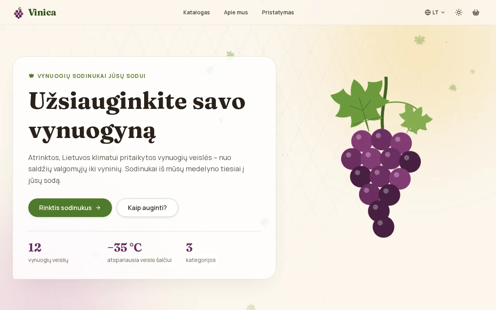
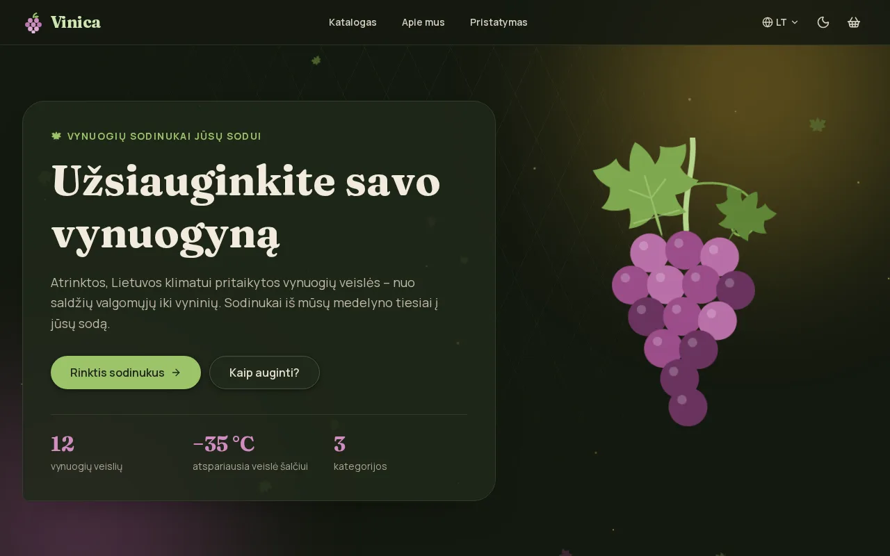
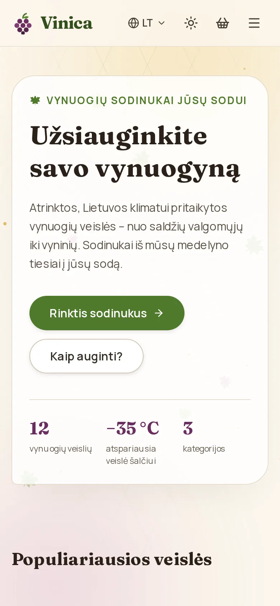

# Vinica — grape seedling shop

**English** · [Lietuvių](README.lt.md)

A multilingual (LT / EN / RU / PL) online shop for grape-vine seedlings, with a live
"morning in the vineyard" background, full checkout with parcel lockers and a small admin panel.

**[Live demo](https://vinica-grape-shop.vercel.app)** · **[Source code](https://github.com/brutall100/vinica-grape-shop)**



<p>
  
  
</p>

## About

Vinica is a shop for a small Lithuanian nursery that grows frost-hardy grape varieties.
Visitors can browse 12 varieties, filter them by use, berry colour and ripening time, add
seedlings to the cart and pay by card. Orders are delivered to Omniva / LP Express parcel lockers
or by courier. The owner manages products, categories, orders and prices in an admin panel.

The design is built around one idea: **a breezy morning in a vineyard**. Vine leaves drift down,
pollen floats in warm sunlight, and at night the same pollen glows like fireflies.

## Features

- **Storefront** — home page, catalog with filters and sorting, product pages, cart, checkout,
  order confirmation, info pages.
- **4 languages** with translated URLs (`/katalogas` ↔ `/en/catalog` ↔ `/ru/catalog`).
- **Payments** with Stripe Checkout + webhook. Without Stripe keys orders are saved as
  "awaiting payment", so the shop is easy to try locally.
- **Delivery** — live Omniva / LP Express locker lists (cached for a day, with a bundled fallback).
- **Admin panel** — sign-in (Auth.js, hashed passwords), dashboard, products with image upload,
  categories, orders with status changes, shop settings.
- **SEO & AI discoverability** — sitemap with hreflang, robots.txt, JSON-LD (`Product`,
  `Organization`, `BreadcrumbList`), `llms.txt`, Open Graph.
- **Live background** — sun and grape glows, a faint trellis texture, falling vine leaves and
  pollen. Every particle gets a random size, speed, delay and drift. Phones get half as many
  particles, and only `transform` and `opacity` are animated.
- **Micro-interactions** — buttons lift, press down and ripple, a leaf sprouts from
  "Add to cart", cards rise on hover, sections fade in while scrolling, hero numbers count up.
- **Light and dark mode** — follows the system setting, has a toggle that remembers your choice,
  and does not flash on load.
- **Accessibility** — "Skip to content" link, visible `:focus-visible`, labelled fields and
  buttons, WCAG AA contrast (checked with numbers), `prefers-reduced-motion` switches movement off.

## Built with

| Area | Tools |
| --- | --- |
| Framework | Next.js 16 (App Router, React Server Components, TypeScript) |
| Styling | Tailwind CSS v4 + palette in CSS variables |
| Database | PostgreSQL + Prisma ORM |
| Languages | next-intl |
| Payments | Stripe (Montonio / Paysera ready to add) |
| Auth | Auth.js v5 |
| E-mail | Resend (logs to the console without a key) |
| Images | local `public/uploads`, Vercel Blob in production |

### Palette — "Vineyard Dawn"

All colours live in `:root` at the top of [`src/app/globals.css`](src/app/globals.css).
Dark mode uses tones from the same palette.

| Role | Light | Dark |
| --- | --- | --- |
| Background | `#FBF6EC` morning cream | `#141910` night vineyard |
| Surface (cards) | `#FFFFFF` | `#20281A` |
| Text | `#2A2118` soil brown | `#F1EBDD` |
| Accent — buttons, links | `#4F7A2B` vine green | `#9CC46A` |
| Second accent — badges, numbers | `#6B2E5F` grape purple | `#D08CC0` |

### Fonts

- **Fraunces** for headings, a soft "old-style" serif that feels like a nursery label
- **Manrope** for text

Both are served by `next/font`, so they are self-hosted and there is no layout shift.

## What I learned

- Building one colour system with CSS variables and pointing Tailwind's colour names at it,
  so the whole app (including the admin panel) switches to dark mode by changing variables only.
- Preventing a theme "flash" with a tiny inline script that runs before the first paint.
- Why a `body` background hides a `position: fixed; z-index: -1` layer, and why the page colour
  belongs on `<html>`.
- Avoiding React hydration errors: animations that change text must run inside their own
  client component, after that component has hydrated.
- Localised routing, JSON-LD and hreflang in the App Router.
- A safe checkout flow: server-side price calculation, Zod validation, Stripe webhooks.

## Run it locally

You need **Node.js 20+** and **PostgreSQL**.

```bash
# 1. Install dependencies
npm install

# 2. Create a database
sudo -u postgres psql -c "CREATE USER vinica WITH PASSWORD 'change_me' CREATEDB;"
sudo -u postgres psql -c "CREATE DATABASE vinica_shop OWNER vinica;"

# 3. Environment variables
cp .env.example .env
#   Fill in at least: DATABASE_URL, AUTH_SECRET (npx auth secret),
#   ADMIN_EMAIL and ADMIN_PASSWORD. Stripe, Resend and Blob keys are optional.

# 4. Tables and demo data (12 varieties, 3 categories, admin user)
npx prisma migrate dev
npm run db:seed

# 5. Start
npm run dev
```

Shop: http://localhost:3000 · Admin: http://localhost:3000/admin (sign in with
`ADMIN_EMAIL` / `ADMIN_PASSWORD` from `.env`).

Useful commands:

```bash
npm run build       # production build
npm run lint        # ESLint
npm run typecheck   # TypeScript
npm run format      # Prettier
npm run test:e2e    # Playwright smoke test (needs a running server)
```

### Why the demo is on Vercel and not GitHub Pages

This is a full-stack app: it needs a Node.js server and a PostgreSQL database. GitHub Pages can
only host static files, so the live demo runs on **Vercel** (free plan) with a free **Neon**
database:

1. Create a PostgreSQL database on [neon.tech](https://neon.tech) and copy its connection string.
2. Import this repository on [vercel.com](https://vercel.com).
3. Add every variable from `.env.example` in **Project → Settings → Environment Variables**
   (`NEXT_PUBLIC_SITE_URL` = your Vercel address).
4. Run migrations and seed once: `DATABASE_URL=... npx prisma migrate deploy` and
   `DATABASE_URL=... npx prisma db seed`.
5. Optional: add a Stripe webhook to `https://<your-domain>/api/webhooks/stripe`
   (events `checkout.session.completed`, `checkout.session.expired`) and put its secret in
   `STRIPE_WEBHOOK_SECRET`.

## Project structure

```
src/
  app/
    (store)/[locale]/      public shop (4 languages, translated URLs)
    (admin)/admin/         admin panel (Lithuanian, protected by Auth.js)
    api/                   Stripe webhook, parcel lockers, auth
    globals.css            palette (CSS variables) + Tailwind theme
    icon.svg               favicon in the palette colours
    sitemap.ts, robots.ts, llms.txt/
  components/
    effects/               live background, ripple/reveal, count-up, theme toggle
    store/  admin/  ui/
  styles/
    living-background.css  glows, trellis, leaves, pollen
    effects.css            buttons, cards, focus, reduced motion
  lib/                     payments, shipping, prisma, seo, e-mail, cart store
  i18n/                    routing and translated pathnames
messages/                  lt.json, en.json, ru.json, pl.json
prisma/                    schema, migrations, seed data
public/products/           grape illustrations (SVG, ~4 KB each)
docs/                      README screenshots (WebP)
scripts/                   placeholder image generator, e2e smoke test
```

## Credits

- Fonts: [Fraunces](https://fonts.google.com/specimen/Fraunces) and
  [Manrope](https://fonts.google.com/specimen/Manrope), SIL Open Font License.
- Icons: [Lucide](https://lucide.dev), ISC License.
- Grape illustrations are generated by `scripts/generate-placeholder-images.mjs`.
- Shop contacts and the admin account in the seed data are fictional (`example.com`).

## License

[MIT](LICENSE) © 2026 brutall100
